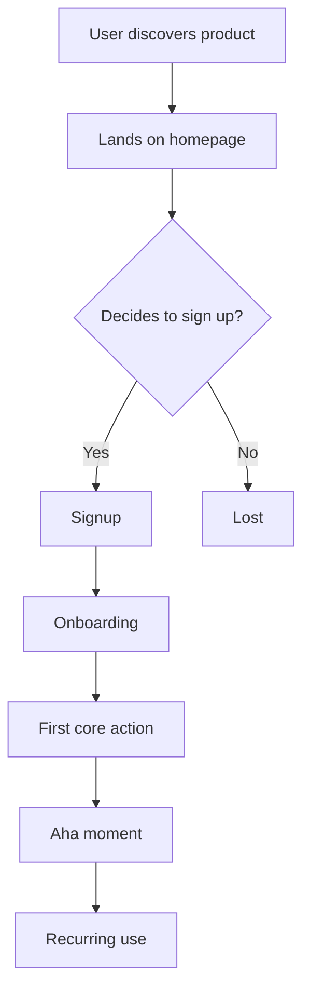
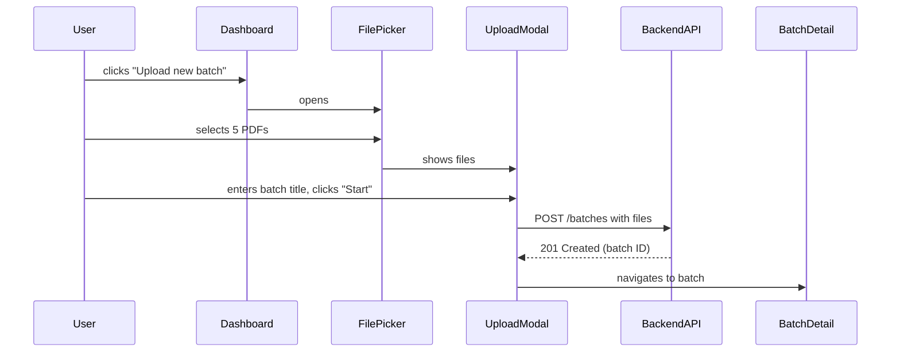
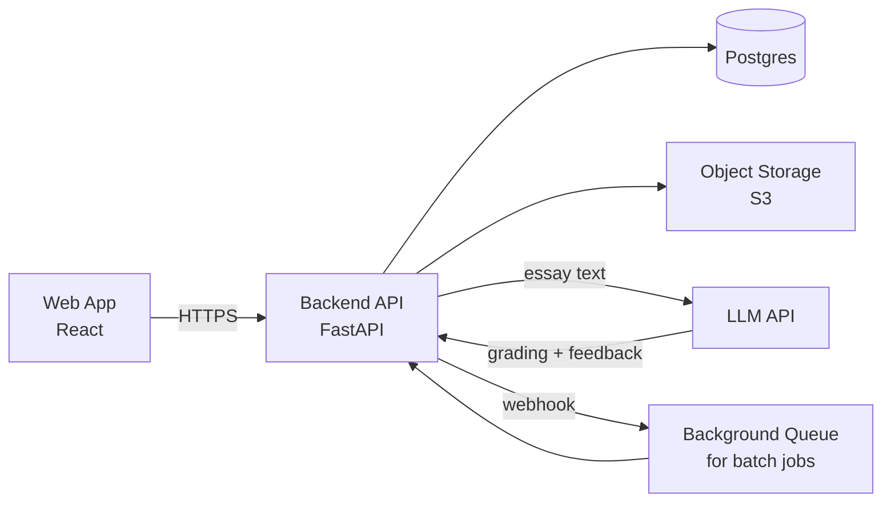

# Product Discovery

Run a structured product discovery flow that takes a raw product idea and produces a PM-grade PRD. The skill runs as a guided interview across ten phases. Each phase asks targeted questions, applies the relevant framework, and ends with a checkpoint where the user confirms before moving on.

The discovery is **resumable** via `discovery-state.md`. The deliverable is a single markdown PRD at `PRD.md` with wireframes, mockups, journeys, and architecture inline as Mermaid/ASCII diagrams. After delivery, **revision mode** lets the user update specific sections.

---

## When to Use

Trigger on any of:
- "start product discovery", "do discovery for X", "discover a product"
- "I have a product idea — walk me through discovery"
- "build a PRD from scratch", "we need a PRD", "PM this for me"
- "validate this idea", "shape this product"
- "revise the [section] of the PRD" (after delivery — see Revision Mode)

## When NOT to Use

- The user wants *just* a PRD from a defined spec (no discovery). Use the framework files directly.
- The user has a single discovery question (just competitive research). Read the relevant framework, don't run the full flow.
- The user is mid-build cycle. This skill is for the *front* of an engagement.

---

## Core Operating Principles

These override the default flow when they conflict with it.

1. **Discovery can kill ideas.** Phase 2 ends with an explicit pursue/kill evaluation. If evidence says don't, the deliverable is a kill memo.
2. **Make assumptions explicit.** Phase 1 ends with an assumptions inventory. Risky assumptions become the PRD's risks section.
3. **User research beats PM intuition.** If the user has interviews, support tickets, sales calls — pull from those before the user's own framing.
4. **Push back on vague metrics.** "Users will love it" gets rewritten into measurable, baselined, time-bound, falsifiable form.
5. **Reconcile scope and timeline.** A 30-feature PRD with a 6-week timeline is named as a contradiction before delivery.
6. **Document what you didn't do.** Paths not taken belong in the PRD. Prevents teams re-litigating settled decisions.
7. **Map every feature to a journey step.** Functional requirements that don't trace to a journey are scope creep.

---

## The Ten-Phase Flow

```
Phase 0:  Context              → Who's asking, why, who reads the output
Phase 1:  Scope & Problem      → Goals, segmentation, problem statement, assumptions
Phase 2:  Competition          → Competitive landscape + kill gate
Phase 3:  User Journeys        → Happy + edge + error + abandonment paths
Phase 4:  Wireframes           → Structural screen sketches
Phase 5:  Low-Fi Mockups       → Annotated mockups with interaction notes
Phase 6:  Epics & Features     → Hierarchy mapped to journey steps
Phase 7:  Technical Overview   → One paragraph + arch diagram
Phase 8:  Metrics Framework    → North-star, primary, secondary with rationale
Phase 9:  GTM                  → ICP, buyer persona, positioning, pricing, channels, marketing+sales
Phase 10: PRD Assembly         → Compile + optional paths-not-taken + optional TAM/SAM/SOM
```

Each phase ends with a **checkpoint** — a summary plus an explicit "ready to move on?" question. The user can say "go back to phase N" anytime.

---

## Resumability

At every invocation, **first check for `discovery-state.md`** in the project root.

### If state file exists

Read it. Show the user a short resume summary, then ask: resume, jump back to revise something, or restart? If restart, archive the old state as `discovery-state.archived-<date>.md`.

### If state file doesn't exist

Create it (format below) and start at Phase 0.

### If `PRD.md` exists and Phase 10 is marked complete

This is **revision mode** — see "Revision Mode" near the end of this skill.

### State file format

```markdown
# Discovery State

**Product:** <one-line name/description>
**Started:** <date>
**Last updated:** <date>

## Current phase
<phase number and name>

## Completed phases
- [ ] Phase 0: Context
- [ ] Phase 1: Scope & Problem
- [ ] Phase 2: Competition
- [ ] Phase 3: User Journeys
- [ ] Phase 4: Wireframes
- [ ] Phase 5: Low-Fi Mockups
- [ ] Phase 6: Epics & Features
- [ ] Phase 7: Technical Overview
- [ ] Phase 8: Metrics Framework
- [ ] Phase 9: GTM
- [ ] Phase 10: PRD Assembly

## Phase 0 — Context (answers)
## Phase 1 — Scope & Problem (answers, locked problem statement)
## Assumptions inventory
## Phase 2 — Competition (answers, kill-gate decision)
## Phase 3 — Journeys (paths captured)
## Phase 4 — Wireframes
## Phase 5 — Mockups
## Phase 6 — Epics & Features (with journey mapping)
## Phase 7 — Technical Overview
## Phase 8 — Metrics Framework
## Phase 9 — GTM
## Phase 10 — PRD Assembly (incl. paths not taken)

## Decisions log
- <date>: <decision> — <reason>

## Revision log (post-delivery)
- <date>: revised <section> — <reason>
```

Update at the end of every phase.

---

## Phase 0 — Context

Goal: understand who's asking, why now, who reads the output.

### 0.1 — Who's asking
Ask in one batch:
1. **Role.** Founder / PM / engineer / designer / consultant / other.
2. **Organizational context.** New startup pre-product / existing startup adding feature / mid-stage new line / enterprise team / agency engagement / other.
3. **Trigger.** Customer signal / internal hypothesis / board ask / competitive pressure / personal pain.

### 0.2 — Who reads the PRD
Ask: *"When this PRD is done, who reads it and acts on it?"* Capture stakeholders. Common readers: Engineering, Design, Marketing, Sales, Leadership, Legal, Finance. This shapes section emphasis in Phase 10.

### 0.3 — Research scope boundaries
Ask: *"What questions are you NOT asking us to answer?"* Capture explicitly out-of-scope research areas (international, legacy migration, long-term roadmap, etc.).

### Checkpoint
Summarize role + context + trigger, key stakeholders, research boundaries. Update state. Ask to proceed.

---

## Phase 1 — Scope & Problem

Goal: lock the problem statement, separate business goals from user goals, segment users explicitly.

### 1.1 — Quick framing
Ask the user to describe the product in one or two sentences. Capture verbatim.

### 1.2 — JTBD framing
Read `references/frameworks/jtbd-canvas.md`. Apply as a **default** step:
1. What job is the customer hiring this product to do? (Job, not feature.)
2. In what situation does this job arise?
3. What outcome do they want? (Functional + emotional.)

### 1.3 — User research input
Ask: *"Do you have any user research — interviews, support tickets, sales calls, surveys, NPS?"*
- **Branch A (has research):** Read `references/frameworks/interview-synthesis.md`. Synthesize 3-5 themes. Cite explicitly in problem statement.
- **Branch B (research exists but not at hand):** Ask if they can pull it. If yes, pause. If no, flag the gap.
- **Branch C (no research):** Add to assumptions inventory as risky. Recommend user interviews as a next step in the final PRD.

### 1.4 — User segmentation
Ask:
1. **Primary user.** Specific. Role, context, what they do today.
2. **Other potential users.** Who *else* might use this? Why are we not optimizing for them?
3. **Anti-users.** Who is this explicitly NOT for? Is there a segment we'd refuse?

The "other potential users" answer is critical — it forces the user to articulate why they picked their primary segment.

### 1.5 — Business goals
Ask: *"What does the **business** want from shipping this?"* Distinct from user goals. Examples:
- Revenue (specific target, e.g., "$X ARR by Y")
- Retention (reduce churn by N%)
- Market share (capture top-3 position in segment)
- Strategic positioning (defensive — block competitor; offensive — open new category)
- Cost reduction (reduce support load by X%)
- Acquisition unlock (enable expansion into segment Z)

Force at least one specific business goal. "Make money" is not a goal.

### 1.6 — User goals (precise)
Ask: *"What does the **user** want from this product?"* Distinct from the JTBD outcome (the job they're hiring it for) — user goals are concrete, observable wants from interacting with the product.

**Required format** for every user goal:
> *"As a [specific user role], I want to [observable action / state] so that [concrete outcome] — measured by [observable signal]."*

Each user goal MUST have:
- **A specific user role.** "As a teacher" beats "as a user." If multiple personas are relevant, write a separate goal per persona — don't combine.
- **An observable action or state.** "Complete grading a class set" — not "feel productive."
- **A concrete outcome.** What changes for the user when they achieve this? "...so I can return graded essays the next day" — not "...so I'm happy."
- **A measurable signal.** How do we know if this goal is being met? "Measured by: time-to-complete <30 min for a 30-essay batch" — not "measured by satisfaction."

**Reject goals that fail any of:**
- Vague subject ("users want...") → ask: which user, specifically?
- Internal feelings as the outcome ("feel confident", "feel productive") → ask: what observable behavior would the confidence cause?
- Marketing language ("seamless experience", "delightful workflow") → rewrite in plain user terms
- Combining multiple goals into one → split them
- No measurable signal → if the goal can't be measured, it can't be achieved

**Examples (rewritten to spec):**
- ✅ *"As a Grade 8 English teacher, I want to grade a class set of 30 persuasive essays in under 30 minutes so I can return them the next day — measured by p50 time-to-complete <30 min."*
- ✅ *"As a teacher returning to the product after a 1-week break, I want to find my in-progress batches without searching so I can continue from where I left off — measured by clicks-to-resume ≤2."*
- ❌ *"Users want a fast and intuitive grading experience"* — vague user, internal feeling, no signal. Rewrite or reject.

Capture **2-4 user goals total**. More than 4 means they're not prioritized; 2 is fine if the product is narrowly scoped. Tag each as **MVP** (must achieve at launch) or **post-MVP** (target for later).

### 1.7 — Scope questions
Walk through, in batches of 2-3:
- Why does the problem matter NOW? What's changed?
- What's the smallest version that delivers value? (MVP thinking.)
- Timeline, budget/team, technical/regulatory constraints?

### 1.8 — Non-goals (precise)
Ask: *"What's explicitly OUT of scope?"* This section is the contract that prevents scope creep. Force precision — vague non-goals get violated; precise non-goals hold.

**Required format** for every non-goal:
> *"[Specific capability or scope] — out of scope because [rationale]. [Time horizon]. Reconsider if [evidence threshold]."*

Each non-goal MUST have:
- **A specific capability or scope.** "Mobile app for iOS" beats "mobile." "Per-classroom permissions" beats "advanced permissions."
- **A rationale.** Why is this out? Resource constraints, strategic focus, lack of validated demand, dependency on something not yet built?
- **A time horizon.** Is this out forever, out for the MVP, out until next quarter? Be explicit.
- **A reconsider trigger.** What evidence would put this back on the table? "Reconsider if 30%+ of MVP users request it via support" or "Reconsider in Q3 planning."

**Categorize non-goals into three buckets:**
1. **Out of MVP** — will likely build later, just not now. Most non-goals fall here.
2. **Out for foreseeable future** — not in roadmap, deliberate strategic choice.
3. **Out forever** — actively against the product's positioning. Rare but powerful.

**Reject non-goals that fail any of:**
- Vague scope ("advanced features", "enterprise stuff", "the AI part") → ask what specifically
- No rationale ("we're not doing X") → ask why
- No time horizon → ask: out forever, this MVP, or this quarter?
- No reconsider trigger → ask: under what conditions would we revisit?
- Negative framing of features that should be goals ("we won't make it slow") → that's not a non-goal, that's a missing requirement

**Examples (rewritten to spec):**
- ✅ *"Native mobile apps (iOS/Android) — out of scope because mobile usage data is unvalidated and would double engineering effort. Out of MVP. Reconsider if 25%+ of beta users explicitly request mobile in feedback."*
- ✅ *"Multi-tenant architecture — out of scope because all confirmed beta customers are single-school deployments. Out for foreseeable future. Reconsider if a multi-school customer signs a >$50K contract."*
- ✅ *"Replacing the teacher's grade entirely (auto-submission to gradebook) — out forever. The product positions as 'AI assists, teacher decides.' Reconsider only if positioning fundamentally changes."*
- ❌ *"Mobile"* — too vague. Reject.
- ❌ *"We won't be slow"* — that's a goal (performance), not a non-goal. Reject.

Capture **3-7 non-goals**. Fewer than 3 usually means the user hasn't thought hard about boundaries; more than 7 usually means some are too granular and should be combined.

### 1.9 — Apply problem-statement framework
Read `references/frameworks/problem-statement.md`. Use it to draft the **locked problem statement** that integrates JTBD, research, segmentation, and goals. Show the draft. Iterate with user. **Do not move on until the user confirms the problem statement is correct.** This is the foundation for everything downstream.

### 1.10 — Optional: Working Backwards
For genuinely new products, offer the Amazon PR/FAQ exercise. Read `references/frameworks/working-backwards.md`. Optional but high-leverage.

### 1.11 — Assumptions inventory
Force 5-10 assumptions, tagged:
- **`validated`** — backed by research/data
- **`assumed`** — believed, low-risk if wrong
- **`risky`** — believed, kills the product if wrong

If the user can't name any risky assumptions, push back: *"What are we betting on that, if wrong, kills this?"*

### Checkpoint
Summarize:
- Locked problem statement (in full)
- Primary user, other segments considered, anti-users
- Top 3 business goals
- Top 3 user goals
- MVP scope, non-goals (3-5)
- Top 3 risky assumptions

Update state. Ask to proceed.

---

## Phase 2 — Competition (with Kill Gate)

Goal: understand the field; explicitly evaluate whether to continue.

### 2.1 — Establish the field
Ask: **"Who do you see as your competitors?"**
- **Branch A (2+ named):** Capture each — target, value prop, pricing if known.
- **Branch B (1 or vague):** Probe substitutes. *"What do users do today instead?"*
- **Branch C ("no competition"):** Push back. Re-ask: substitutes? Predecessors? Failed attempts?
  - If genuinely no named competitors after probing: do your own research. Web search if available; if not, reason structurally about substitute categories. Confirm findings with user.

### 2.2 — Apply competitive-analysis framework
Read `references/frameworks/competitive-analysis.md`. For each competitor: target, core value prop, where they win, where they lose, pricing.

### 2.3 — Find the gap
Synthesize: where's the positioning gap this product fills? Not "missing features" — "user/job/context poorly served."

If no clear gap surfaces, capture explicitly. Feeds the kill gate.

### 2.4 — Kill Gate (non-optional)

After analysis, **explicitly evaluate**:

```
## Kill Gate Evaluation

### Reasons to PROCEED
- <reason>
- <reason>

### Reasons to RECONSIDER
- <weak signal on user pain>
- <saturated market>
- <unclear gap>
- <untested risky assumptions>
- <regulatory/technical blocker>

### Recommendation
<PROCEED | PROCEED WITH CAVEATS | RECONSIDER | KILL>
```

The recommendation is yours. Be willing to recommend KILL.

If **KILL**: ask the user — (a) produce a kill memo and stop, (b) continue but elevate risks in PRD, (c) loop back to Phase 1 to re-scope. If (a), produce kill memo (1 page: original idea, what was explored, why not to pursue, what would change the answer) and end.

If **PROCEED WITH CAVEATS**: the caveats become required PRD inclusions.

### Checkpoint
Summarize competitors + gap + kill-gate result. Update state. Ask to proceed.

---

## Phase 3 — Detailed User Journeys

Goal: map how users move through the product **including edge cases, error states, and abandonment paths**.

### 3.1 — Happy path
Walk the primary user from "doesn't know about product" to "recurring value." Use Mermaid:



For each step: one-line description. **Identify the aha moment** — flag it.

### 3.2 — Edge paths
Map each of these as a separate Mermaid diagram:
1. **Abandonment path.** User signs up but doesn't complete onboarding. Where do they drop?
2. **Error path.** User attempts the core action and it fails (network, validation, permissions). What recovery is offered?
3. **Retry path.** User has tried once, gave up, comes back. What's the experience the second time?
4. **Power-user limit path.** A user reaches a constraint of the MVP (rate limit, missing feature). What's the upgrade or handoff?

### 3.3 — Error states inventory
For each *core action* in the happy path, list the failure modes:
- Network failure
- Invalid input
- Permission denied
- Resource not found
- Rate limit / quota exceeded
- Backend timeout
- Concurrent edit / conflict

For each: what does the user see? What can they do? Is the error recoverable? This becomes a section in the PRD.

### 3.4 — Multi-user interactions (if applicable)
If the product involves multiple users (collaborative, marketplace, social), map the cross-user flows:
- User A invites User B
- Concurrent edits / conflicts
- Permission boundaries
- Notification delivery

If single-user, skip this step.

### 3.5 — Friction inventory
List 3-5 highest-friction points across all paths. For each: what's the friction, MVP handling (accept or address), post-MVP plan.

### 3.6 — Derive screens
From all journeys (happy + edge + error), list every distinct user-facing screen. **Bridges to Phase 4.** Typical: 5-10 screens for a useful MVP.

### Checkpoint
Show happy path + 4 edge paths + error inventory + friction inventory + screen list. Ask: *"Are the journeys complete? Edge cases I missed? Are these the right screens?"* Update state.

---

## Phase 4 — Wireframes

Goal: structural sketches of each screen at the resolution that lets the team build.

### 4.1 — Wireframe each derived screen
Take the screen list from Phase 3.6. For each, produce ASCII or Mermaid.

ASCII example:
```
┌──────────────────────────────────────┐
│  Logo       [Search]      [Profile]  │
├──────────────────────────────────────┤
│                                      │
│  Hero: "One sentence value prop"     │
│  [Primary CTA]                       │
│                                      │
├──────────────────────────────────────┤
│  Three feature cards                 │
└──────────────────────────────────────┘
```

For each screen:
- 2-3 sentence description
- Reference the journey step it serves ("Serves happy path step 4.")
- Most important element on screen
- Next action

### 4.2 — Validate journey-screen alignment
Every screen serves a journey step; every step that's user-facing has a screen. Reconcile mismatches.

### Checkpoint
Show all wireframes. Ask alignment. Update state.

---

## Phase 5 — Low-Fi Mockups

Goal: take the wireframes one fidelity level deeper. Wireframes show *structure*; mockups show *behavior, content, and interaction*.

Mockups remain text-based (ASCII / Mermaid) but with **rich annotation** the wireframes don't have.

### 5.1 — Mock the top 3-5 screens
Pick the most important screens from Phase 4 (typically: landing, signup/onboarding, core feature, key edge state). Skip ancillary screens.

For each, produce a richer ASCII mockup with:

**Realistic content** (not "Hero text here" — actual hero text the product would use)

**Interaction annotations** below the mockup:
- What's clickable, what's not
- Hover states, active states, disabled states
- Loading states
- Empty states (what shows when there's no data?)
- Error states (inline, not separate screen)

**Content notes**:
- Microcopy for primary buttons, error messages, tooltips
- Validation rules ("Password must be 8+ chars, 1 number")
- Placeholder/example text

**State variations**:
- First-time user vs. returning
- Free tier vs. paid tier
- Different permission levels
- Different user segments (if relevant)

Example mockup with annotations:

```
┌─────────────────────────────────────────────────┐
│  ✱ GraderAI       [Help]      Mr. Singh ▼      │
├─────────────────────────────────────────────────┤
│                                                 │
│  Welcome back, Mr. Singh.                       │
│  You have 3 essay batches in progress.          │
│                                                 │
│  ┌──────────────────────────────┐               │
│  │ + Upload new batch           │  ← primary CTA │
│  └──────────────────────────────┘               │
│                                                 │
│  Recent batches                                 │
│  ┌─────────────────────────────────────┐       │
│  │ Grade 8 — Persuasive essays         │       │
│  │ 24 essays · 18 graded · ▶ continue  │       │
│  ├─────────────────────────────────────┤       │
│  │ Grade 7 — Narrative essays          │       │
│  │ 30 essays · all graded · view       │       │
│  └─────────────────────────────────────┘       │
└─────────────────────────────────────────────────┘
```

**Interactions:**
- "Upload new batch" → opens file picker accepting .pdf, .docx, .jpg up to 10MB each
- Batch row click → opens batch detail screen
- "▶ continue" → resumes grading at the next ungraded essay

**Content notes:**
- Greeting uses user's salutation if available, otherwise first name
- Batch title is user-supplied at upload time, max 60 chars
- Progress shows "X of Y graded" or "all graded" if done

**States:**
- Empty state (no batches yet): show a 3-step "get started" guide instead of the recent batches list
- Loading state: skeleton rows in the list area
- Free tier: show "2 of 5 free batches used this month" banner above CTA
- Error state (upload failed): inline red banner above CTA with retry link

### 5.2 — Annotate cross-screen flows
For the 1-2 most important interactions across screens, produce a Mermaid sequence diagram:



### Checkpoint
Show all mockups with annotations + cross-screen flows. Ask: *"Do these mockups capture the interactions correctly? Anything missing or wrong?"* Update state.

---

## Phase 6 — Epics, Features, and Mapping

Goal: produce a hierarchical breakdown — epics → features — with each feature mapped to specific journey steps.

### 6.1 — Identify epics
An **epic** is a major area of functionality, typically delivered across multiple sprints. Group functionality into 3-7 epics. Examples for an essay-grading product:
- **E1: Authentication & user management**
- **E2: Essay batch upload and management**
- **E3: AI grading engine**
- **E4: Teacher review and override**
- **E5: Reporting and exports**
- **E6: Account and billing**

If the user names 10+ epics, push back — likely some are features, not epics.

### 6.2 — Decompose epics into features
For each epic, list 3-7 features. A **feature** is a discrete capability that can be built and tested. Example for E2:
- F2.1: Drag-drop batch upload
- F2.2: PDF / DOCX / image format support
- F2.3: Batch metadata (title, grade level, prompt)
- F2.4: Batch status tracking
- F2.5: Batch deletion

### 6.3 — Map each feature to journey steps
Every feature must map to at least one journey step. Format as a table:

| Feature | Maps to journey step |
|---|---|
| F2.1: Drag-drop batch upload | Happy path step 5 ("Upload first batch") |
| F2.2: Format support | Happy path step 5; Error path "unsupported format" |
| F2.3: Batch metadata | Happy path step 5; Power-user path "find old batch" |

If a feature doesn't map to any journey step → either (a) add a journey step you missed, or (b) cut the feature. Features without journey grounding are scope creep.

### 6.4 — MVP vs. post-MVP
Tag each feature as **MVP** or **post-MVP**. The MVP set should:
- Cover the happy path end-to-end
- Cover at least the critical edge paths
- Total no more than ~60-70% of all features (otherwise the MVP isn't an MVP)

### Checkpoint
Show epic list, features per epic, mapping table, MVP vs. post-MVP split. Ask: *"Are the epics correct? Do all features trace to journeys? Is the MVP cut realistic?"* Update state.

---

## Phase 7 — Technical Overview

Goal: a single paragraph and a Mermaid architecture diagram. **Not a full spec.** Just enough to ground the engineering conversation.

### 7.1 — Synthesize from prior phases
Pull from:
- Constraints (Phase 1.7 — tech, regulatory)
- Wireframes/mockups (Phase 4-5 — implies frontend stack, real-time vs. batch)
- Multi-user interactions (Phase 3.4 — implies sync, conflict resolution)
- Epics (Phase 6 — implies major system components)

### 7.2 — One-paragraph technical overview
Write a single paragraph (max 150 words) covering:
- Frontend approach (web app / mobile / desktop / multiple)
- Backend approach (monolith / services / serverless)
- Key external dependencies (LLM API, payment processor, storage, etc.)
- Data sensitivity / compliance scope (if relevant)
- Real-time vs. batch processing (if relevant)
- Major technical risks/decisions to flag for engineering

Example:
> *"Web-first product, React/Next.js frontend with a Python backend (FastAPI). Core grading uses an LLM API (likely Anthropic or OpenAI — to be evaluated for accuracy on student essays). User-uploaded essays stored in object storage with signed URLs; redacted of PII before sending to LLM. Single-tenant architecture for MVP. Key risks: LLM cost per essay at scale, latency for batch grading (likely needs background processing), and grading consistency across runs (may require fine-tuning or careful prompting)."*

### 7.3 — Architecture diagram
A simple Mermaid diagram showing the major components and data flow:



Keep it high-level. No internal services, no class diagrams, no schema. The point is to communicate shape, not implementation.

### Checkpoint
Show the paragraph + the diagram. Ask: *"Does this match how you imagine the system? Any major components missing?"* Update state.

---

## Phase 8 — Metrics Framework

Goal: a structured metrics hierarchy with rationale per metric.

### 8.1 — North-star metric
The single metric that, if it goes up, means the product is genuinely working. Not a vanity metric. Examples:
- Weekly active users who completed the core action (not just visited)
- Customer retention at month 3 (not just signups)
- Number of successful outcomes (essays graded with teacher accepting the AI grade)

Ask: *"If this product is succeeding 6 months from now, what single number tells you that?"*

For the chosen metric, capture:
- **Definition** — exactly what's measured (and what's excluded)
- **Target** — the value at which we'd say it's working
- **Baseline** — the value today, if the product exists; or "TBD" if pre-launch
- **Rationale** — why THIS metric, not others. What does it capture that alternatives don't?

### 8.2 — Primary metrics (3-5)
Metrics that drive the north-star. If these move, the north-star moves. Examples for a product with a "weekly active completing core action" north-star:
- New user activation rate (new users → completing core action within 7 days)
- Time to first core action
- Core action completion rate (started → finished)
- Repeat-use rate (D7 retention)

For each primary metric:
- Definition, target, baseline, rationale
- **Connection to north-star** — explicitly state how it drives the north-star

### 8.3 — Secondary metrics (3-5)
Operational and health metrics. Don't drive the north-star directly but reveal problems.
- Support ticket volume (rising = friction increasing)
- Error rate on core action
- Page load time
- Funnel drop-off at each step

For each: definition, target/threshold, rationale.

### 8.4 — Failure thresholds
What values would tell us this isn't working? Be concrete. *"D30 retention < 15% → re-evaluate"* beats *"low retention is bad."*

### 8.5 — Validate every metric
For each metric across the framework, validate:
- **Measurable** — can we compute the number?
- **Baselined** — do we have a current value or is there a path to one?
- **Time-bound** — when do we measure?
- **Falsifiable** — what value = failure?

Reject metrics that fail. Rewrite with the user.

### Checkpoint
Show the framework: north-star + primaries + secondaries + failure thresholds. Ask: *"Do these metrics give us the right signal? Anything missing or weak?"* Update state.

---

## Phase 9 — GTM

Goal: ICP, buyer persona, positioning, pricing, channels, marketing+sales plan.

### 9.1 — ICP (Ideal Customer Profile)
Read `references/frameworks/persona-canvas.md`.

**ICP is at the company / segment level.** Capture:
- Firmographics: company size, industry, geography, stage
- Triggers that prompt them to look for a solution
- Buying behavior: who decides, who influences, average sales cycle, budget range
- Why they fit: alignment with the problem, urgency, ability to extract value

If B2C, "ICP" becomes "primary segment definition" — same logic, individual-level.

### 9.2 — Buyer persona
**Distinct from ICP.** The buyer persona is the individual who makes or influences the purchase decision within an ICP company.

For each persona (typically 1-3):
- Role / title
- Day-to-day responsibilities
- What they care about (KPIs they're measured on)
- Where they get information (publications, communities, peers)
- Objections they'll have to your product
- What they need to see to buy

In B2B, the buyer persona is often *not* the user. Capture both if they differ. Map decision-influencer relationships.

### 9.3 — Positioning
Read `references/frameworks/positioning-canvas.md`.

**Product positioning statement** (one sentence):
> "For [user] who [need], [product] is a [category] that [value prop]. Unlike [alternative], we [differentiator]."

**Three things this is "the X for"** — sharpens category definition.

**What this is NOT** — clarifies more than what it is.

**Brand positioning** (distinct from product positioning):
- Voice and tone (e.g., expert and direct, vs. friendly and warm)
- Visual identity hints (e.g., minimal and tech-forward, vs. approachable and human)
- Emotional positioning — how should users feel using this? Confident? Empowered? Calm?

Brand positioning shapes marketing assets, copy, design language. One paragraph.

### 9.4 — Pricing and business model
Read `references/frameworks/monetizing-innovation.md`.

1. **Pricing model.** Subscription / usage / one-time / freemium / hybrid / other.
2. **Price-point hypothesis.** A specific number with rationale. *"$50/seat/month because competitor X is at $40 and we deliver 2x value."* If unknown: capture as risky assumption.
3. **Willingness-to-pay signal.** Real evidence (interviews, comparable products, prior pricing experiments) or "no signal — flag as highest-risk."
4. **Pricing tiers** if applicable. What does free vs. paid get you? What's the upgrade trigger?

### 9.5 — Distribution channels
List 2-3 primary channels for acquiring the ICP. For each:
- Channel name (LinkedIn ads, content/SEO, partnerships, outbound sales, Product Hunt, etc.)
- Why it fits the ICP (where they hang out, how they buy)
- Approximate role: primary acquisition vs. secondary / nurture

### 9.6 — GTM motion
Read `references/frameworks/gtm-strategy.md`. Pick: PLG / sales-led / PLG+sales-assist / community-led / partner-led. One paragraph rationale based on ACV (from 9.4), customer profile (from 9.1-9.2), product complexity.

### 9.7 — Marketing plan (high level)
One paragraph for each:
- **Content & SEO.** What 3-5 content themes will we own? Where do they live (blog, LinkedIn, YouTube)?
- **Paid acquisition.** Channels, hypothesis on CAC, budget shape (early-stage testing vs. scaled)
- **Community / earned.** How do we build awareness without paying? Speaking, partnerships, integrations, social proof?
- **Lifecycle marketing.** Email/in-product nurture from signup → first value → retention.

### 9.8 — Sales plan (high level)
If sales-led or sales-assisted:
- **Sales motion.** Inbound (lead → sales) / outbound (sales → lead) / hybrid?
- **Sales process.** How many stages? Average cycle length? Who closes?
- **Pricing flexibility.** List price + discount policy, or fixed?
- **Customer success handoff.** What happens post-sale to drive retention?

If purely PLG with no sales: skip this. Note it explicitly.

### 9.9 — Launch shape
- **Pre-launch:** Waitlist, content seeding, beta program, advisor network
- **Launch:** Day-zero plan (PR, Product Hunt, owned channels, partner co-launch)
- **Post-launch:** 30-90 day momentum (case studies, expansion content, optimization)

### Checkpoint
Show ICP, buyer persona, positioning (product + brand), pricing, channels, motion, marketing/sales plan, launch. Ask: *"Does this GTM hold together? Are there assumptions to challenge?"* Update state.

---

## Phase 10 — PRD Assembly

Goal: produce the deliverable. Compile everything; add paths-not-taken; reconcile timeline; offer optional TAM/SAM/SOM.

### 10.1 — Pull from prior phases
Read `discovery-state.md`. Read `references/templates/PRD.md.template`. Pull all answers and decisions.

### 10.2 — Paths not taken (optional)
Ask the user: *"Do you want to include a 'Paths Not Taken' section in the PRD? It documents alternatives we considered and rejected — high value for downstream readers because it prevents teams from re-litigating decisions, but takes a few minutes to gather. Include or skip?"*

**If skip:** don't include the section. Move on to 10.3.

**If include:** prompt the user with specific examples to surface alternatives:
- Phase 1: Were there other primary user segments considered?
- Phase 2: Were there market positioning approaches we discarded?
- Phase 6: Are there features we considered that are now in post-MVP or cut entirely?
- Phase 9: Were there pricing models we explored?

For each path not taken, capture:
- What the alternative was
- Why it was rejected (with one-sentence rationale)
- What evidence would change the decision

This becomes a dedicated section in the PRD.

### 10.3 — Timeline reconciliation (non-optional)
Compare functional requirements (Phase 6 MVP set) against stated timeline (Phase 1.7).

Heuristic:
- 1-3 features + simple integrations → 4-6 weeks feasible
- 4-8 features + moderate complexity → 8-12 weeks
- 9-15 features → 3-6 months
- 16+ features → multi-phase roadmap

If mismatched, name it directly:

```
## Timeline-vs-Scope Reconciliation
The MVP lists <N> features with a <T>-week timeline. This is likely <too aggressive | feasible | comfortable>.

Options:
1. Cut scope. Candidates: <list 2-3 lowest-priority MVP features>.
2. Extend timeline. Realistic estimate: <revised>.
3. Phase the rollout. MVP1 (week 0-X): <core>. MVP2 (week X-Y): <secondary>.

Which path?
```

Don't deliver until resolved. If user dismisses, capture as top risk.

### 10.4 — Optional: TAM/SAM/SOM
Ask: *"Do you want to include market sizing in the PRD? This is TAM/SAM/SOM analysis. It's useful for fundraising, board updates, or strategic alignment, but requires either (a) credible bottom-up data, or (b) accepting wide error bars on top-down estimates. Skip if neither applies."*

If user says yes:
- **TAM (Total Addressable Market):** Total revenue available if we captured 100%. Top-down (industry reports) or bottom-up (segment count × ACV).
- **SAM (Serviceable Addressable Market):** TAM × (% reachable given product capabilities and geography).
- **SOM (Serviceable Obtainable Market):** SAM × (% capturable in the next 3-5 years given competition, GTM, resources).

Be explicit about methodology. Tag every number as "data-backed" or "estimated based on assumptions." Better to say "TAM: $5B (rough estimate based on industry reports)" than to fabricate precision.

If user says skip: don't include the section. Don't penalize the user for skipping — TAM/SAM/SOM is theatrical when the data isn't there.

### 10.5 — Draft the PRD
Fill in `references/templates/PRD.md.template`. Section emphasis follows Phase 0.2 stakeholders:
- Engineering reader → expand functional requirements, technical overview, error states
- Sales reader → expand ICP, buyer persona, competitive, pricing
- Legal reader → expand non-functional with compliance language
- Leadership reader → expand TL;DR, business goals, metrics, risks

Don't omit sections. If light, label explicitly (e.g., *"Technical overview: TBD with engineering review."*).

### 10.6 — Final review
Show the PRD. Ask:
- Anything to add, cut, sharpen?
- Sections that feel weak?
- Do the metrics still feel right after seeing everything together?

Iterate.

### 10.7 — Write the file
Write to `PRD.md` in the project root. Update `discovery-state.md`:
- Mark Phase 10 complete
- Add to decisions log: "PRD delivered <date>"
- Initialize empty Revision log

### 10.8 — Hand off
Tell the user:

> *"PRD is at `PRD.md`. Discovery state is at `discovery-state.md`.*
>
> *To revise: just say "revise the [section name]" — I'll edit both files. Common triggers: stakeholder feedback, scope cuts after engineering review, new evidence, timeline changes."*

---

## Revision Mode

Activates when:
- `PRD.md` exists
- `discovery-state.md` shows Phase 10 complete
- User requests a change ("revise [section]", "update [section]", "the [section] needs to change")

### Flow

1. **Identify section.** If user names it, use that. If not, ask which.
2. **Read current state.** Find the section in `PRD.md` and the corresponding phase in `discovery-state.md`.
3. **Understand the change.** Why? Stakeholder feedback, scope cut, new evidence?
4. **Propose the edit.** Show diff (old → new). Confirm.
5. **Apply.** Update both files. Append to revision log:
   ```
   - <date>: revised <section> — <reason>
   ```
6. **Cross-check cascades.** Some revisions ripple. Metrics changed → TL;DR may need update. GTM motion changed → channels need review. Surface and ask.

### Not revision mode
- "Redo the whole thing" → fresh discovery. Archive current state and PRD, start at Phase 0.
- 5+ revisions in log → suggest re-discovery: *"This PRD has been revised 5 times. The underlying discovery may need to be revisited. Re-enter Phase 1?"*

---

## Voice and Style

- **Pragmatic.** No buzzwords. If a sentence could appear in a McKinsey deck, rewrite it.
- **Evidence-led.** Every claim sourced or marked as assumption.
- **Tradeoff-honest.** Name what each choice buys and costs.
- **Falsifiable.** Metrics are measurable. "Good engagement" is not a metric.

---

## Anti-Patterns

- **Asking all questions in a phase at once.** Group in batches of 2-3.
- **Skipping the checkpoint.** Each phase ends with explicit user confirmation.
- **Skipping the kill gate.** Phase 2 ends with pursue/kill. Skipping produces PRDs for ideas that should have died.
- **Letting the user skip phases ad hoc.** Ask why. Sometimes legitimate ("we did this work already"); sometimes resistance.
- **Producing the PRD before completing all phases.** PRD is the assembly step.
- **Treating wireframes as design.** Structural only.
- **Mockups without interaction annotations.** That's just a wireframe.
- **Features that don't trace to journey steps.** Cut them or add the missing journey.
- **Vague metrics.** "Users will love it" is not a metric. Push back, rewrite.
- **Suppressing timeline-vs-scope mismatch.** Name it. Don't paper over.
- **Including TAM/SAM/SOM without data.** Skip the section if the data isn't there. Theatrical numbers hurt credibility.
- **Vague user goals or non-goals.** Goals without measurable signals and non-goals without time horizons + reconsider triggers don't hold under scope pressure. Force precision in Phase 1.6 and 1.8.

---

## Reading Order Reference

| Phase | Step | File |
|---|---|---|
| 1 | 1.2 | `references/frameworks/jtbd-canvas.md` |
| 1 | 1.3 (if research) | `references/frameworks/interview-synthesis.md` |
| 1 | 1.9 | `references/frameworks/problem-statement.md` |
| 1 | 1.10 (optional) | `references/frameworks/working-backwards.md` |
| 2 | 2.2 | `references/frameworks/competitive-analysis.md` |
| 9 | 9.1 | `references/frameworks/persona-canvas.md` |
| 9 | 9.3 | `references/frameworks/positioning-canvas.md` |
| 9 | 9.4 | `references/frameworks/monetizing-innovation.md` |
| 9 | 9.6 | `references/frameworks/gtm-strategy.md` |
| 10 | 10.1 | `references/templates/PRD.md.template` |

Other frameworks (`opportunity-tree`, `hypothesis`, `solution-brief`, `experiment-design`, `prioritization`, `stakeholder-summary`) are available. Reach for them when a phase surfaces a need:
- **Opportunity tree** — Phase 1: multiple candidate problems, need to choose
- **Hypothesis** — Phase 1: critical assumption needs flagging for validation
- **Solution brief** — Phase 4-5: multiple solution directions, need explicit choice
- **Experiment design** — assumption needs validation before build
- **Prioritization** — Phase 6: MVP feature set needs cutting to fit timeline
- **Stakeholder summary** — Phase 0: complex multi-stakeholder situation
